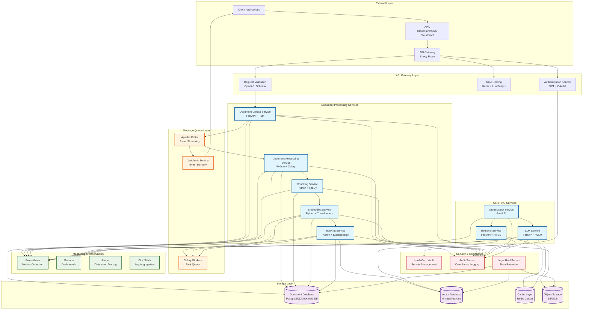
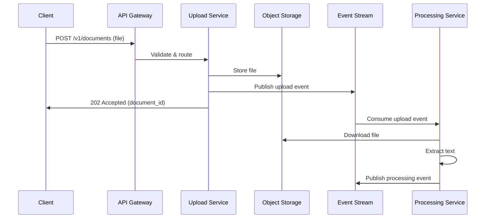
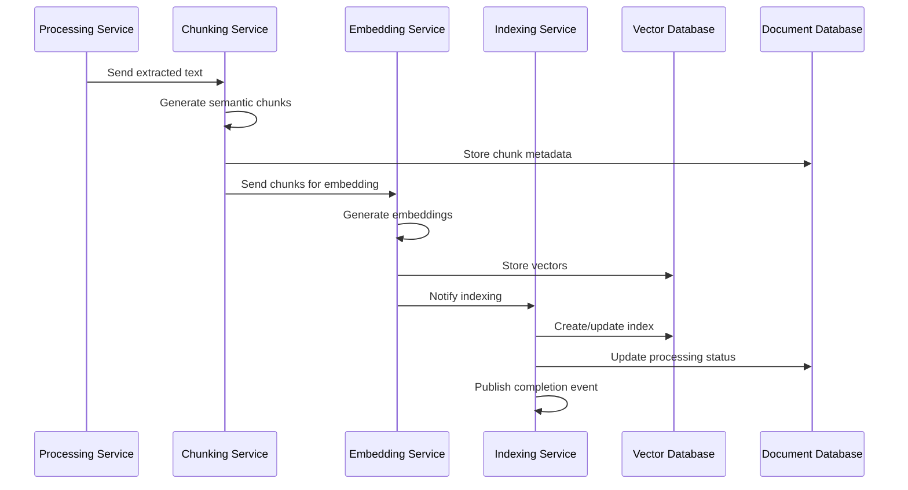
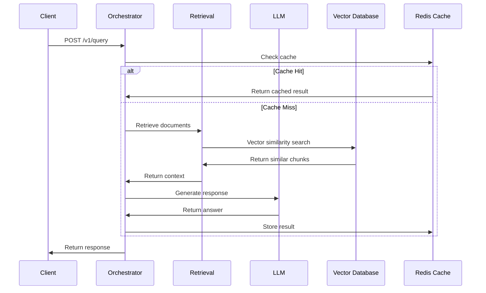

# 🏗️ Service Architecture - Phase 2 Document Processing

## 📋 **Executive Summary**

**Enterprise Document Processing Service Architecture** for RAG Platform Phase 2, designed following Google-scale microservices principles with zero-trust security, horizontal scalability, and production-grade reliability.

**Key Metrics:**

- **Target Scale:** 1M+ documents, 10K+ RPS, <500ms P99 latency
- **Availability:** 99.99% uptime with multi-region deployment
- **Security:** Zero-trust architecture with end-to-end encryption
- **Compliance:** SOC2/FedRAMP ready with comprehensive audit trails

---

## 🎯 **Architecture Principles**

### **1. Microservices Design**

- **Single Responsibility:** Each service has one clear purpose
- **Loose Coupling:** Services communicate via well-defined APIs
- **High Cohesion:** Related functionality grouped together
- **Independent Deployment:** Services can be deployed independently

### **2. Scalability & Performance**

- **Horizontal Scaling:** Auto-scaling based on demand
- **Async Processing:** Non-blocking operations for better throughput
- **Caching Strategy:** Multi-layer caching for performance
- **Load Balancing:** Intelligent traffic distribution

### **3. Reliability & Resilience**

- **Circuit Breakers:** Prevent cascade failures
- **Retry Logic:** Exponential backoff with jitter
- **Health Checks:** Comprehensive service monitoring
- **Graceful Degradation:** Fallback mechanisms

### **4. Security & Compliance**

- **Zero Trust:** Never trust, always verify
- **mTLS:** Mutual TLS for service-to-service communication
- **Encryption:** Data encrypted at rest and in transit
- **Audit Logging:** Complete audit trail for compliance

---

## 🏗️ **Service Architecture Diagram**



---

## 🔧 **Service Specifications**

### **1. Document Upload Service**

```yaml
Service: document-upload-service
Technology: FastAPI + Rust (for file processing)
Port: 8003
Replicas: 3-10 (auto-scaling)
Resources:
  CPU: 1000m-2000m
  Memory: 2Gi-4Gi
  Storage: 10Gi (temp files)
Responsibilities:
  - File upload validation
  - Virus scanning
  - File format detection
  - Storage path generation
  - Event publishing
Endpoints:
  - POST /v1/documents (file upload)
  - GET /v1/documents/{id}/status
  - DELETE /v1/documents/{id}
```

### **2. Document Processing Service**

```yaml
Service: document-processing-service
Technology: Python + Celery + Redis
Port: 8004
Replicas: 5-20 (auto-scaling)
Resources:
  CPU: 2000m-4000m
  Memory: 4Gi-8Gi
  Storage: 20Gi (temp processing)
Responsibilities:
  - Text extraction (PDF, DOCX, etc.)
  - Content validation
  - Metadata extraction
  - Processing status tracking
  - Error handling and retry
Dependencies:
  - PyPDF2, python-docx, BeautifulSoup
  - Tesseract OCR
  - spaCy for NLP
```

### **3. Chunking Service**

```yaml
Service: chunking-service
Technology: Python + spaCy + Transformers
Port: 8005
Replicas: 3-15 (auto-scaling)
Resources:
  CPU: 1000m-3000m
  Memory: 4Gi-8Gi
  Storage: 5Gi
Responsibilities:
  - Semantic chunking
  - Sentence boundary detection
  - Overlap management
  - Chunk quality scoring
  - Position tracking
Dependencies:
  - spaCy for NLP
  - sentence-transformers
  - nltk for text processing
```

### **4. Embedding Service**

```yaml
Service: embedding-service
Technology: Python + Transformers + PyTorch
Port: 8006
Replicas: 2-10 (auto-scaling)
Resources:
  CPU: 2000m-8000m
  Memory: 8Gi-16Gi
  GPU: 1-2 (optional)
  Storage: 10Gi (model cache)
Responsibilities:
  - Vector embedding generation
  - Model management
  - Batch processing
  - Quality validation
  - Vector storage coordination
Dependencies:
  - sentence-transformers
  - PyTorch
  - transformers library
```

### **5. Indexing Service**

```yaml
Service: indexing-service
Technology: Python + Elasticsearch + Milvus
Port: 8007
Replicas: 2-8 (auto-scaling)
Resources:
  CPU: 1000m-2000m
  Memory: 2Gi-4Gi
  Storage: 5Gi
Responsibilities:
  - Vector index management
  - Search index updates
  - Index optimization
  - Query routing
  - Performance monitoring
Dependencies:
  - pymilvus
  - elasticsearch-py
  - faiss-cpu
```

### **6. Webhook Service**

```yaml
Service: webhook-service
Technology: Python + FastAPI + Celery
Port: 8008
Replicas: 2-5 (auto-scaling)
Resources:
  CPU: 500m-1000m
  Memory: 1Gi-2Gi
  Storage: 1Gi
Responsibilities:
  - Webhook registration
  - Event delivery
  - Retry logic
  - Rate limiting
  - Delivery tracking
Dependencies:
  - httpx for HTTP clients
  - celery for async tasks
  - redis for rate limiting
```

---

## 🔄 **Data Flow Architecture**

### **1. Document Upload Flow**



### **2. Document Processing Pipeline**



### **3. RAG Query Flow**



---

## 🚀 **Deployment Architecture**

### **1. Kubernetes Deployment**

```yaml
# Example deployment for document-upload-service
apiVersion: apps/v1
kind: Deployment
metadata:
  name: document-upload-service
  namespace: rag-platform
spec:
  replicas: 3
  selector:
    matchLabels:
      app: document-upload-service
  template:
    metadata:
      labels:
        app: document-upload-service
    spec:
      containers:
        - name: upload-service
          image: rag-platform/document-upload:latest
          ports:
            - containerPort: 8003
          env:
            - name: DATABASE_URL
              valueFrom:
                secretKeyRef:
                  name: database-secrets
                  key: url
            - name: REDIS_URL
              valueFrom:
                secretKeyRef:
                  name: redis-secrets
                  key: url
          resources:
            requests:
              cpu: 1000m
              memory: 2Gi
            limits:
              cpu: 2000m
              memory: 4Gi
          livenessProbe:
            httpGet:
              path: /health
              port: 8003
            initialDelaySeconds: 30
            periodSeconds: 10
          readinessProbe:
            httpGet:
              path: /ready
              port: 8003
            initialDelaySeconds: 5
            periodSeconds: 5
```

### **2. Service Mesh (Istio)**

```yaml
# Istio VirtualService for document processing
apiVersion: networking.istio.io/v1beta1
kind: VirtualService
metadata:
  name: document-processing-vs
  namespace: rag-platform
spec:
  hosts:
    - document-processing.rag-platform.com
  http:
    - match:
        - uri:
            prefix: /v1/documents
      route:
        - destination:
            host: document-upload-service
            port:
              number: 8003
        - destination:
            host: document-processing-service
            port:
              number: 8004
      timeout: 30s
      retries:
        attempts: 3
        perTryTimeout: 10s
```

### **3. Auto-scaling Configuration**

```yaml
# Horizontal Pod Autoscaler
apiVersion: autoscaling/v2
kind: HorizontalPodAutoscaler
metadata:
  name: document-processing-hpa
  namespace: rag-platform
spec:
  scaleTargetRef:
    apiVersion: apps/v1
    kind: Deployment
    name: document-processing-service
  minReplicas: 3
  maxReplicas: 20
  metrics:
    - type: Resource
      resource:
        name: cpu
        target:
          type: Utilization
          averageUtilization: 70
    - type: Resource
      resource:
        name: memory
        target:
          type: Utilization
          averageUtilization: 80
  behavior:
    scaleUp:
      stabilizationWindowSeconds: 60
      policies:
        - type: Percent
          value: 100
          periodSeconds: 15
    scaleDown:
      stabilizationWindowSeconds: 300
      policies:
        - type: Percent
          value: 10
          periodSeconds: 60
```

---

## 🔒 **Security Architecture**

### **1. Zero-Trust Network**

```yaml
# NetworkPolicy for document processing
apiVersion: networking.k8s.io/v1
kind: NetworkPolicy
metadata:
  name: document-processing-netpol
  namespace: rag-platform
spec:
  podSelector:
    matchLabels:
      app: document-processing-service
  policyTypes:
    - Ingress
    - Egress
  ingress:
    - from:
        - namespaceSelector:
            matchLabels:
              name: rag-platform
        - podSelector:
            matchLabels:
              app: document-upload-service
      ports:
        - protocol: TCP
          port: 8004
  egress:
    - to:
        - namespaceSelector:
            matchLabels:
              name: rag-platform
      ports:
        - protocol: TCP
          port: 5432 # PostgreSQL
        - protocol: TCP
          port: 6379 # Redis
        - protocol: TCP
          port: 9092 # Kafka
```

### **2. mTLS Configuration**

```yaml
# PeerAuthentication for mTLS
apiVersion: security.istio.io/v1beta1
kind: PeerAuthentication
metadata:
  name: default
  namespace: rag-platform
spec:
  mtls:
    mode: STRICT
```

### **3. Authorization Policy**

```yaml
# AuthorizationPolicy for service access
apiVersion: security.istio.io/v1beta1
kind: AuthorizationPolicy
metadata:
  name: document-processing-authz
  namespace: rag-platform
spec:
  selector:
    matchLabels:
      app: document-processing-service
  rules:
    - from:
        - source:
            principals:
              ["cluster.local/ns/rag-platform/sa/document-upload-service"]
      to:
        - operation:
            methods: ["POST", "GET"]
            paths: ["/v1/process"]
```

---

## 📊 **Monitoring & Observability**

### **1. Metrics Collection**

```yaml
# Prometheus ServiceMonitor
apiVersion: monitoring.coreos.com/v1
kind: ServiceMonitor
metadata:
  name: document-processing-monitor
  namespace: rag-platform
spec:
  selector:
    matchLabels:
      app: document-processing-service
  endpoints:
    - port: metrics
      interval: 30s
      path: /metrics
```

### **2. Distributed Tracing**

```yaml
# Jaeger configuration
apiVersion: v1
kind: ConfigMap
metadata:
  name: jaeger-config
  namespace: rag-platform
data:
  jaeger.yaml: |
    service:
      name: document-processing-service
    sampling:
      type: const
      param: 1
    reporter:
      logSpans: true
      localAgentHostPort: jaeger-agent:6831
```

### **3. Log Aggregation**

```yaml
# Fluentd configuration
apiVersion: v1
kind: ConfigMap
metadata:
  name: fluentd-config
  namespace: rag-platform
data:
  fluent.conf: |
    <source>
      @type tail
      path /var/log/containers/*document-processing*.log
      pos_file /var/log/fluentd-document-processing.log.pos
      tag kubernetes.document-processing
      format json
    </source>
    <match kubernetes.document-processing>
      @type elasticsearch
      host elasticsearch.rag-platform.svc.cluster.local
      port 9200
      index_name document-processing-logs
    </match>
```

---

## 🎯 **Performance Targets**

### **1. Latency Requirements**

| Operation       | P50   | P95   | P99 | SLA   |
| --------------- | ----- | ----- | --- | ----- |
| Document Upload | 100ms | 500ms | 1s  | 99.9% |
| Text Extraction | 2s    | 10s   | 30s | 99.5% |
| Chunking        | 500ms | 2s    | 5s  | 99.9% |
| Embedding       | 1s    | 5s    | 15s | 99.5% |
| Indexing        | 200ms | 1s    | 3s  | 99.9% |
| RAG Query       | 100ms | 500ms | 1s  | 99.9% |

### **2. Throughput Requirements**

| Service             | Target RPS | Burst RPS | Concurrent Users |
| ------------------- | ---------- | --------- | ---------------- |
| Document Upload     | 1,000      | 5,000     | 10,000           |
| Processing Pipeline | 500        | 2,000     | 5,000            |
| RAG Query           | 10,000     | 50,000    | 100,000          |

### **3. Availability Requirements**

| Component           | Availability | RTO | RPO |
| ------------------- | ------------ | --- | --- |
| API Gateway         | 99.99%       | 30s | 0s  |
| Document Processing | 99.95%       | 5m  | 1m  |
| Vector Database     | 99.99%       | 1m  | 0s  |
| Object Storage      | 99.999%      | 1h  | 0s  |

---

## 🔄 **Disaster Recovery**

### **1. Multi-Region Deployment**

```yaml
# Multi-region deployment strategy
Regions:
  Primary: us-central1
  Secondary: europe-west4
  Tertiary: asia-southeast1

Replication:
  Database: Active-Active with conflict resolution
  Object Storage: Cross-region replication
  Vector Database: Read replicas in all regions
  Cache: Redis Cluster with cross-region sync
```

### **2. Backup Strategy**

```yaml
Backup Schedule:
  Database: Every 6 hours (incremental), daily (full)
  Object Storage: Continuous replication
  Vector Database: Daily snapshots
  Configuration: Git-based with automated backups

Retention:
  Database: 30 days (incremental), 1 year (full)
  Object Storage: 7 years (compliance)
  Vector Database: 90 days
  Logs: 1 year
```

---

## 🎯 **Next Steps & Implementation Roadmap**

### **Phase 2A: Core Services (Sprint 1-2)**

1. **Document Upload Service** - File upload and validation
2. **Document Processing Service** - Text extraction and processing
3. **Database Schema** - Implement and test database design
4. **Basic API Endpoints** - Core document management APIs

### **Phase 2B: Processing Pipeline (Sprint 3-4)**

1. **Chunking Service** - Semantic text chunking
2. **Embedding Service** - Vector embedding generation
3. **Indexing Service** - Vector database integration
4. **Batch Processing** - Batch document processing

### **Phase 2C: Integration & Optimization (Sprint 5-6)**

1. **RAG Integration** - Connect with existing RAG services
2. **Webhook System** - Event-driven notifications
3. **Performance Optimization** - Caching and optimization
4. **Monitoring Setup** - Comprehensive observability

### **Phase 2D: Production Readiness (Sprint 7-8)**

1. **Security Hardening** - Zero-trust implementation
2. **Compliance Features** - Audit trails and legal holds
3. **Disaster Recovery** - Multi-region deployment
4. **Load Testing** - Performance validation

---

## 📚 **Technology Stack Summary**

| Component               | Technology             | Purpose                                 |
| ----------------------- | ---------------------- | --------------------------------------- |
| **API Gateway**         | Envoy Proxy            | Traffic routing and load balancing      |
| **Document Processing** | Python + FastAPI       | Text extraction and processing          |
| **File Processing**     | Rust + Tokio           | High-performance file operations        |
| **Message Queue**       | Apache Kafka           | Event streaming and async processing    |
| **Task Queue**          | Celery + Redis         | Background task processing              |
| **Database**            | PostgreSQL/CockroachDB | Document metadata and processing status |
| **Vector Database**     | Milvus/Weaviate        | Vector embeddings and similarity search |
| **Cache**               | Redis Cluster          | High-performance caching                |
| **Object Storage**      | S3/GCS                 | Document file storage                   |
| **Monitoring**          | Prometheus + Grafana   | Metrics and dashboards                  |
| **Tracing**             | Jaeger                 | Distributed tracing                     |
| **Logging**             | ELK Stack              | Log aggregation and analysis            |
| **Secrets**             | HashiCorp Vault        | Secrets management                      |
| **Service Mesh**        | Istio                  | Service-to-service communication        |
| **Orchestration**       | Kubernetes             | Container orchestration                 |

---

**Last Updated:** 2024-01-XX
**Version:** 1.0.0
**Architect:** Principal Platform Architect
**Review Status:** Ready for Implementation
