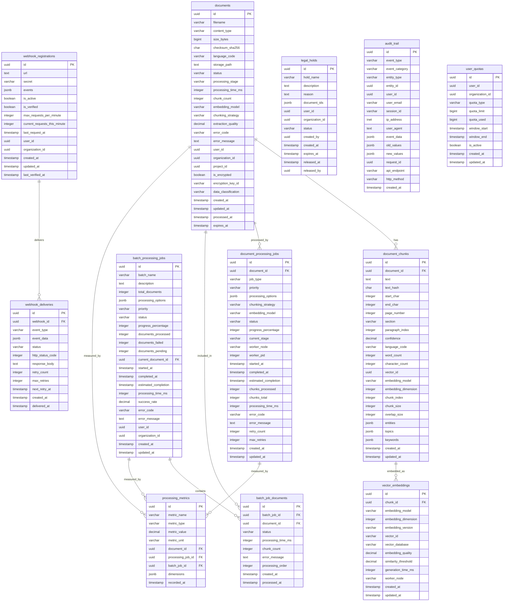

# 🗄️ Database Schema Diagram - Phase 2 Document Processing

## 📊 **Entity Relationship Diagram**



## 🔗 **Key Relationships**

### **1. Document Processing Flow**

```
documents → document_processing_jobs → document_chunks → vector_embeddings
```

### **2. Batch Processing Flow**

```
batch_processing_jobs → batch_job_documents → documents → document_chunks
```

### **3. Webhook Event Flow**

```
webhook_registrations → webhook_deliveries → audit_trail
```

### **4. Compliance Flow**

```
legal_holds → documents → audit_trail
```

## 📊 **Data Flow Patterns**

### **Document Upload & Processing**

1. **Document Upload** → `documents` table (status: UPLOADING)
2. **Processing Job** → `document_processing_jobs` table (status: PENDING)
3. **Text Extraction** → `document_chunks` table
4. **Embedding Generation** → `vector_embeddings` table
5. **Completion** → Update `documents` status to COMPLETED

### **Batch Processing**

1. **Batch Creation** → `batch_processing_jobs` table
2. **Document Assignment** → `batch_job_documents` table
3. **Individual Processing** → Each document follows upload flow
4. **Batch Completion** → Update batch status and metrics

### **Webhook Notifications**

1. **Event Occurrence** → Trigger webhook delivery
2. **Webhook Delivery** → `webhook_deliveries` table
3. **Audit Logging** → `audit_trail` table
4. **Retry Logic** → Handle failed deliveries

## 🎯 **Performance Considerations**

### **Indexing Strategy**

- **Primary Keys:** UUID with gen_random_uuid()
- **Foreign Keys:** Indexed for join performance
- **Status Fields:** Indexed for filtering
- **Timestamp Fields:** Indexed for time-based queries
- **Composite Indexes:** For complex queries

### **Partitioning Strategy**

- **Time-based Partitioning:** Monthly partitions for `documents` table
- **User-based Sharding:** For multi-tenant deployments
- **Status-based Partitioning:** Separate partitions for active/archived data

### **Query Optimization**

- **Views:** Pre-computed aggregations for common queries
- **Materialized Views:** For complex reporting queries
- **Connection Pooling:** Efficient database connection management

## 🔒 **Security & Compliance**

### **Data Protection**

- **Encryption:** Support for encrypted document storage
- **Access Control:** Row-level security for multi-tenant data
- **Audit Trail:** Comprehensive logging of all operations

### **Compliance Features**

- **GDPR:** Data deletion and retention policies
- **Legal Hold:** Document preservation for litigation
- **Data Classification:** Sensitivity level tracking
- **Audit Logging:** Complete audit trail for compliance

---

**Last Updated:** 2024-01-XX
**Version:** 1.0.0
**Maintainer:** Platform Engineering Team
